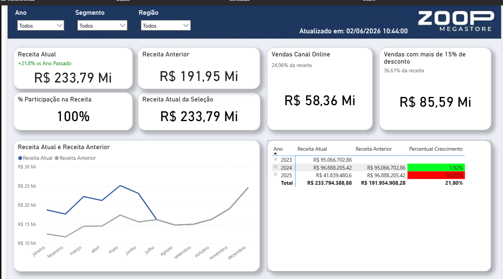
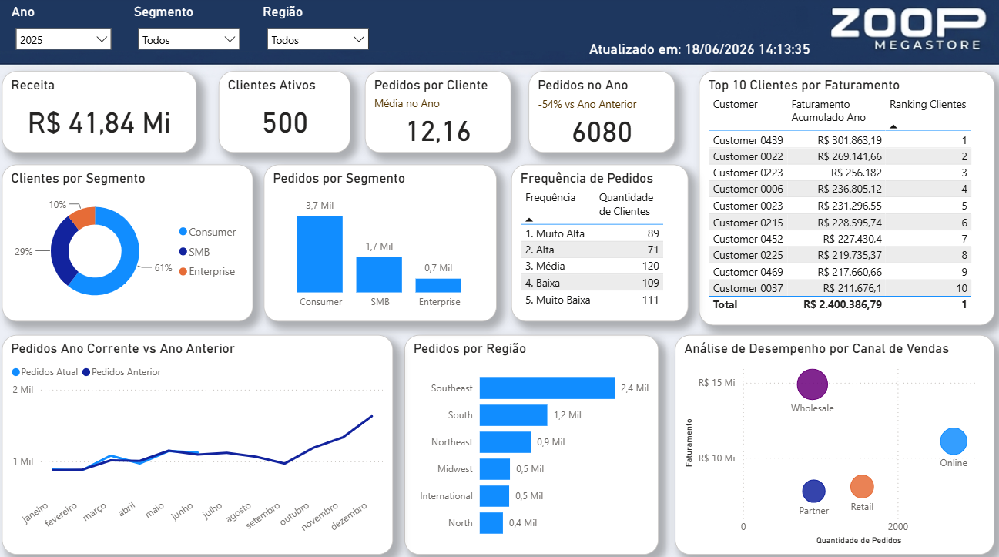

# 📊 Análise Financeira e Comercial Zoop

<p align="center">
  
  
</p>

<p align="center">


</p>

## 📌 Sobre o Projeto

Dashboard analítico desenvolvido com base no curso **Power BI: Análises Avançadas com DAX**, da Alura.

O projeto foi criado para apoiar a tomada de decisão da empresa fictícia **Zoop Megastore**, reunindo indicadores financeiros e comerciais em dashboards interativos.

A solução permite analisar o desempenho do negócio sob diferentes perspectivas:

* 📈 Evolução da receita ao longo do tempo;
* 👥 Monitoramento da base de clientes ativos;
* 🛒 Análise de pedidos e frequência de compra;
* 🌐 Avaliação do desempenho dos canais de vendas;
* 🏢 Comparação entre segmentos de mercado;
* 🌎 Distribuição das vendas por região;
* 🎯 Identificação de tendências de crescimento e oportunidades de negócio.

---

## 🚀 Dashboards Desenvolvidos

### 📊 Dashboard Financeiro

<p align="center">
  
</p>

Painel voltado para acompanhamento da receita e indicadores financeiros da empresa.

#### KPIs Disponíveis

| Indicador                    | Objetivo                                           |
| ---------------------------- | -------------------------------------------------- |
| Receita Atual                | Receita total do período selecionado               |
| Receita Ano Anterior         | Comparação com o período anterior                  |
| Participação na Receita      | Representatividade da seleção atual                |
| Receita Atual da Seleção     | Receita considerando filtros aplicados             |
| Receita Canal Online         | Receita proveniente do canal online                |
| Receita com +15% de Desconto | Receita gerada por vendas com descontos agressivos |
| Crescimento da Receita       | Evolução percentual da receita                     |

---

### 👥 Dashboard Comercial e Clientes

<p align="center">
  
</p>

Painel destinado à análise operacional das vendas, comportamento dos clientes e desempenho comercial.

#### KPIs Disponíveis

| Indicador             | Objetivo                                         |
| --------------------- | ------------------------------------------------ |
| Clientes Ativos       | Quantidade de clientes com movimentação          |
| Pedidos no Ano        | Total de pedidos realizados                      |
| Pedidos por Cliente   | Média de pedidos por cliente ativo               |
| Pedidos por Segmento  | Distribuição dos pedidos por segmento            |
| Frequência de Pedidos | Perfil de recorrência dos clientes               |
| Top 10 Clientes       | Ranking dos clientes com maior faturamento       |
| Pedidos por Região    | Distribuição geográfica das vendas               |
| Desempenho por Canal  | Comparação entre faturamento e volume de pedidos |

---

## 🎛️ Recursos Interativos

Os dashboards contam com recursos de exploração dinâmica para facilitar análises estratégicas:

✅ Filtro por Ano

✅ Filtro por Segmento

✅ Filtro por Região

✅ Comparação temporal automática

✅ Indicadores dinâmicos

✅ Análise multidimensional

✅ Navegação interativa por contexto de negócio

---

## 📈 Principais Insights Obtidos

Os painéis permitem responder perguntas estratégicas como:

### Financeiro

* Qual foi o crescimento da receita em relação ao ano anterior?
* Quanto do faturamento é gerado pelo canal online?
* Qual o impacto financeiro das vendas com descontos acima de 15%?
* Quais períodos apresentaram maior crescimento ou retração?
* Como a receita se comporta entre regiões e segmentos?

### Comercial e Clientes

* Quais clientes geram maior faturamento?
* Qual segmento concentra o maior volume de pedidos?
* Como os pedidos estão distribuídos entre as regiões?
* Qual canal apresenta melhor desempenho entre volume e faturamento?
* Como se comporta a frequência de compra dos clientes?
* Existe concentração de receita em poucos clientes?
* Quais regiões apresentam maior potencial comercial?

---

## 🧠 Técnicas DAX Aplicadas

Durante o desenvolvimento foram utilizadas funções avançadas para modelagem analítica e inteligência temporal.

### Inteligência Temporal

```DAX
SAMEPERIODLASTYEAR()
```

Comparação automática entre períodos equivalentes de anos diferentes.

### Manipulação de Contexto

```DAX
CALCULATE()
ALL()
```

Alteração e remoção de filtros para construção de métricas analíticas.

### Cálculos Percentuais

```DAX
DIVIDE()
```

Criação de indicadores percentuais com tratamento seguro de divisões.

### Filtros Dinâmicos

```DAX
CALCULATE(
    [Vendas Ano Corrente],
    DimChannel[Channel] = "Online"
)
```

Segmentação de métricas por regras de negócio.

---

## 📊 Principais Medidas Desenvolvidas

### Receita Atual

```DAX
Receita Ano Atual =
CALCULATE(
    [Vendas Ano Corrente],
    ALL(DimCustomer)
)
```

### Receita Ano Anterior

```DAX
Receita Ano Passado =
CALCULATE(
    [Vendas Ano Corrente],
    SAMEPERIODLASTYEAR(dCalendario[Date]),
    ALL(DimCustomer)
) + 0
```

### Participação na Receita

```DAX
Percentual Filial =
DIVIDE(
    [Vendas Ano Corrente],
    [Receita Ano Atual]
)
```

### Receita Canal Online

```DAX
Total Vendas Online =
CALCULATE(
    [Vendas Ano Corrente],
    DimChannel[Channel] = "Online"
)
```

### Receita com Desconto Superior a 15%

```DAX
Total Vendas Acima 15 =
CALCULATE(
    [Vendas Ano Corrente],
    FactSales[DiscountPct] > 0.15
)
```

### Crescimento da Receita

```DAX
Percentual Crescimento =
IF(
    DIVIDE(
        [Vendas Ano Corrente] - [Receita Ano Passado],
        [Receita Ano Passado]
    ) > -1,
    DIVIDE(
        [Vendas Ano Corrente] - [Receita Ano Passado],
        [Receita Ano Passado]
    ),
    BLANK()
)
```

---

## 🏗️ Estrutura do Projeto

```text
Analise-Financeira-Zoop
│
├── Dados
│   └── zoop-dataset.xlsx
│
├── Power BI
│   └── analise-financeira-zoop.pbix
│
├── Assets
│   ├── painel-receita.png
│   ├── painel-clientes.png
│   └── painel-receita.mp4
│
└── README.md
```

---

## 🎯 Competências Demonstradas

* Power BI
* DAX Avançado
* Business Intelligence
* Data Analytics
* Modelagem de Dados
* KPIs Financeiros
* KPIs Comerciais
* Inteligência Temporal
* Storytelling com Dados
* Dashboards Interativos
* Análise de Receita
* Análise de Clientes
* Segmentação de Mercado
* Performance Comercial

---

## 📚 Curso

Projeto desenvolvido durante o curso:

**Power BI: Análises Avançadas com DAX** — Alura

---

## ⚠️ Observação

Os dados utilizados neste projeto são fictícios e foram disponibilizados exclusivamente para fins educacionais durante o curso.

---

## 👨‍💻 Autor

**Vinicius Cunha**

[](https://linkedin.com/in/viniciuscunhadata)

[](https://github.com/vcbonani)
